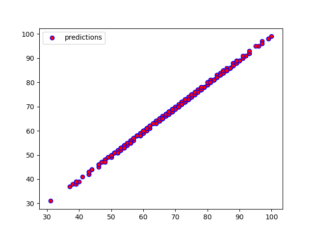

# Student's Performance Predictor

Student’s Performance Predictor application is for predicting student’s performance in exam on the bases of student’s test preparation, test scores,etc. So that, teachers can give students appropriate advice and motivation to improve the performance in exam. Student Performance Predictor uses linear regression machine learning algorithm to predict students total score, grade and result.

### Dataset

Dataset for Student's Performance Predictor contains the following features:

- **gender:** Gender of Student (Male or Female)
- **parental level of education:** Education level for parents (Bachelor's degree, Some college, Master's degree, Associate's degree, High school, Some high school)
- **lunch:** Standard or Reduced
- **test preparation course:** Completed or None
- **math score:** Scores of math test
- **reading score:** Scores of reading test
- **writing score:** Scores of Writing test

The dataset is given in `Data/` directory.

### Model

All the modules and code for Student's Performance Predictor are given in `Model/` directory. 

### Output [Click here for video demo](https://github.com/patelvini/Student-s-Performance-Predictor/blob/master/Output/Performance_predictor.mp4)

